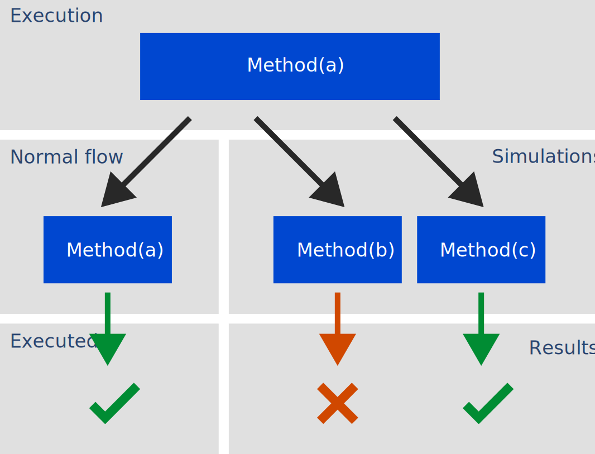

# Reflekt

<p align="center">
  
</p>
<p align="center">
  <a href="https://www.mozilla.org/MPL/2.0/" alt="MPLv2 License">
    
  </a>
  <a href="https://rubygems.org/gems/reflekt">
    
  </a>
</p>

*Reflective testing.*

Traditional testing is fine but it's not perfect. Tests often check for a golden path that works, when errors actually happen when the code or user does something unexpected. And with automated testing humans still have to write the tests.

**Reflekt** writes the tests for you, and tests in the negative for situations that you wouldn't have noticed. It works out of the box with no extra coding required. Because Reflekt tests your objects as they are used in the normal flow of the application, you get real world test results.

## Usage  

Add `prepend Reflekt` inside a class:
```ruby
class ExampleClass
  prepend Reflekt
```  

Use the application as usual and test results will start showing up in the `reflections` folder.

## Installation

**Bundler:**

In Gemfile add:
```ruby
gem "reflekt"
```  

In terminal run:
```
bundle install
```

**RubyGems:**

In terminal run:
```
gem install reflekt
```

## Configuration

You can configure Reflekt to skip "no undo" methods like deletion and sending email:

In your class add:

```ruby
reflekt_skip :method_name
```

Also consider disabling Reflekt on methods that do the final rendering to the UI, to avoid a visual mess of duplicated elements.

## How it works

When a method is called in the usual flow of an application, Reflekt runs multiple simulations with different values on that method to see if it can break things, before handing back control to the method to perform its usual task.

<p align="center">
  
</p>

## Comparison

Conceptual differences between testing methodologies:

|                   | Traditional testing        | Generative testing                    | Reflective testing                     |
--------------------|----------------------------|---------------------------------------|----------------------------------------|
| **Automation**    | ❌ Tests defined manually. | ❌ Tests defined semi-automatically. | ✅ Tests defined automatically.         |
| **Granularity**   | ✅ Tests PASS or FAIL.     | ✅ Tests PASS or FAIL.               | ✅ Tests averaged into a PASS RATE.     |
| **Replication**   | ❌ Tests run externally.   | ❌ Tests run externally.             | ✅ Tests run internally in normal flow. |
| **Feedback loop** | ❌ Tests run periodically. | ❌ Tests run periodically.           | ✅ Tests run in real time.              |

Consider this logic:  
1. Tests often check that things work (in the positive)  
2. Errors happen when things break (in the negative)  
3. Tests should check more often for the negative  
4. This can be automated

## QA

**Q.** Can I use it alongside test driven development too?  
**A.** Yes!
