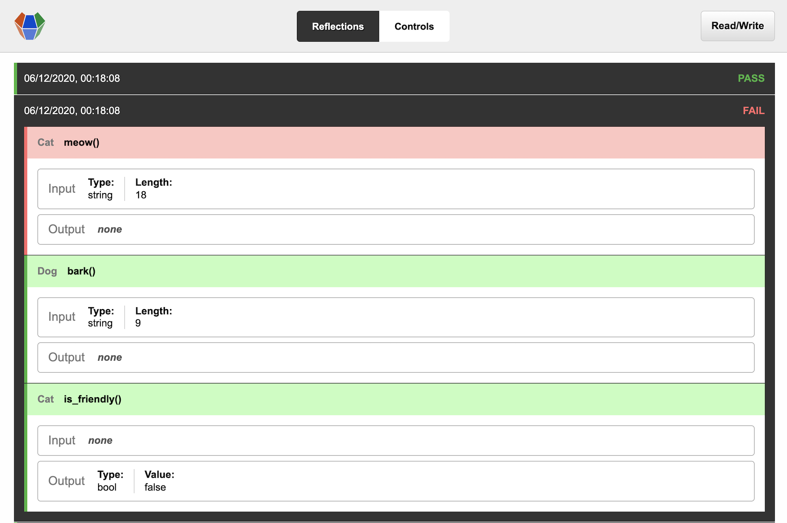

# Reflekt

<p align="center">
  
</p>
<p align="center">
  <a href="https://www.mozilla.org/MPL/2.0/" alt="MPLv2 License">
    
  </a>
  <a href="https://rubygems.org/gems/reflekt">
    
  </a>
</p>

*Reflective testing.*

Traditional testing is fine but it's not perfect. Tests often check for a golden path that works, when errors actually happen when the code or user does something unexpected. And with automated testing humans still have to write the tests.

**Reflekt** writes the tests for you, and tests in the negative for situations that you wouldn't have noticed. It works out of the box with no extra coding required. Because Reflekt tests your objects as they are used in the normal flow of the application, you get real world test results.

## Usage  

Add `prepend Reflekt` inside a class:
```ruby
class ExampleClass
  prepend Reflekt
```  

Use the application as usual and test results will start showing up in the `reflections` folder:

<p align="center">
  
</p>

## Installation

In Gemfile add:
```ruby
gem "reflekt"
```  

In terminal run:
```
bundle install
```

## Configuration

```ruby
Reflekt.configure do |config|

  # Reflekt is enabled by default and should be disabled on production.
  config.enabled = true

  # The amount of reflections to create per method call.
  config.reflect_amount = 5

end
```

See `Config.rb` for more configuration options.

## Test data

You can configure Reflekt to skip "no undo" methods like deletion and sending email:

```ruby
class ExampleClass
  reflekt_skip :method_name
```

### Displaying test data

Use `reflekt_skip` on methods that do the final render to the UI to avoid a visual mess of duplicated elements.
Separate the final output from the rendering logic so that Reflekt can track changes in output.

**Don't do:**
```ruby
def show(product)

  # Business logic.
  product.title = "Showing #{product.name}"

  # Rendering logic.
  puts products

end
```

**Do:**
```ruby
reflekt_skip :render

# Business logic.
def show(product)
  product.title = "Showing #{product.name}"  
  render(product)
end

# Rendering logic.
def render(product)
  puts product
end
```

### Saving test data

Use `reflekt_skip` on the method that saves to the database to avoid persisting test data. If you still want to save test data to the database then use [dependency injection](https://www.reddit.com/r/programming/comments/iz3rks/if_youre_not_practicing_within_the_scope_of_a/g6i1ex3/) to connect to a dummy database.

## How it works

When a method is called in the usual flow of an application, Reflekt runs multiple simulations with different values on that method to see if it can break things, before handing back control to the method to perform its usual task.

<p align="center">
  
</p>


### Control-Experiment loop

Reflekt builds itself as you build your application.

Terminology:
* `Control` - A shapshot of real data (a subclass of `Reflection`)
* `Experiment` - A shapshot of random data (a subclass of `Reflection`)

The loop:
1. You write code and run it
2. A `Control` reflection is created per method call, tracking input and output
3. A set of rules are created from each `Control` on how the program works
4. Many `Experiment` reflections are created per method call, containing random input and output
5. Each `Experiment` is tested to pass or fail the set of rules previously defined by each `Control`
6. Results are saved to the `/reflections` directory
7. Your application returns its output

This feedback loop creates better results the more you develop and use your application.

## Comparison

Conceptual differences between testing methodologies:

|                   | Traditional testing       | Generative testing           | Reflective testing        |
--------------------|---------------------------|------------------------------|---------------------------|
| **Automation**    | ❌ Defined manually       | ❌ Defined semi-automatically | ✅ Defined automatically  |
| **Granularity**   | ✅ Tests PASS or FAIL     | ✅ Tests PASS or FAIL         | ✅ Tests PASS or FAIL     |
| **Replication**   | ❌ Tests run externally   | ❌ Tests run externally       | ✅ Tests run internally   |
| **Feedback**      | ❌ Tests run periodically | ❌ Tests run periodically     | ✅ Tests run in real time |

**Tests run internally**  
Tests run alongside the normal execution of the program using the exact same code. There is no duplicate code in different files/environments calling the same APIs.

**Tests run in real time**  
Multiple simulations run as you develop and use your application.

**Consider this logic:**  
1. Tests often check that things work (in the positive)  
2. Errors happen when things break (in the negative)  
3. Tests should check more often for the negative  
4. This can be automated

## Philosophy

**To keep coding fun.** There are too many layers these days. It doesn't just make coding less fun, it makes it harder for new programmers to learn programming.  
**To stop duplicate code.** RIP DRY. You use to hear that a lot but not anymore. Traditional tests are just duplicate code, we don't need them.  
**To test code better.** By completly automating testing we get 100% coverage and test for situations we never thought possible.  
